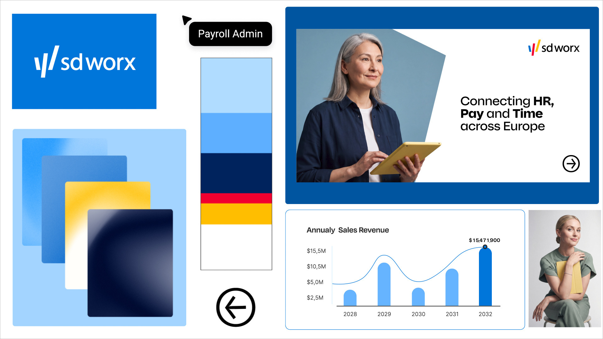
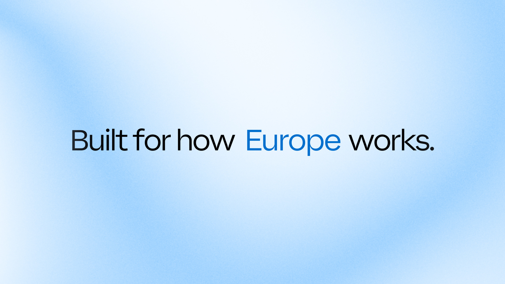
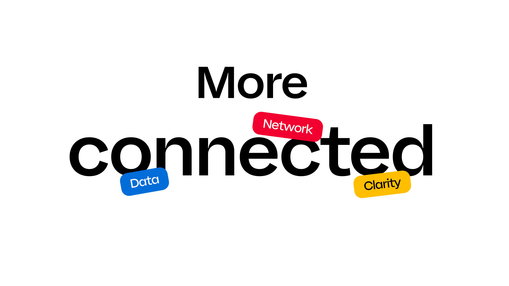
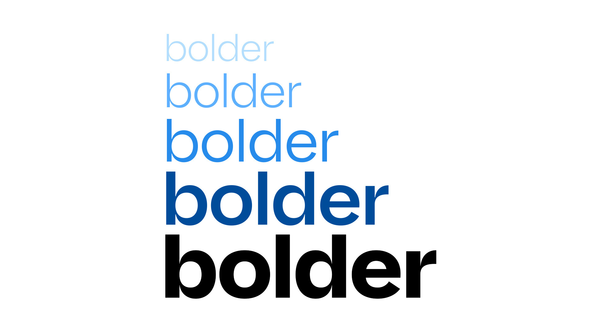
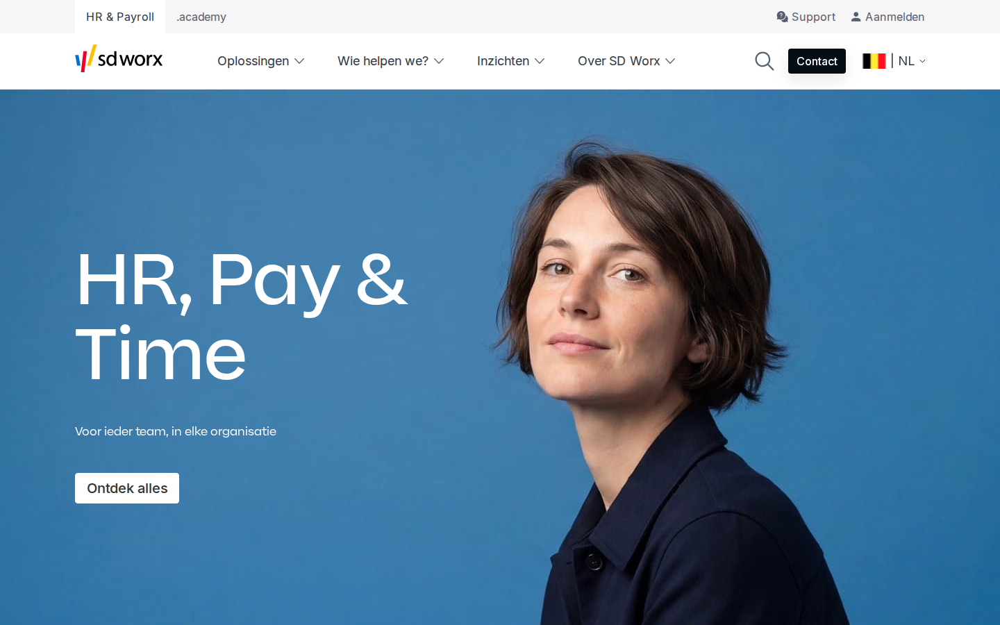
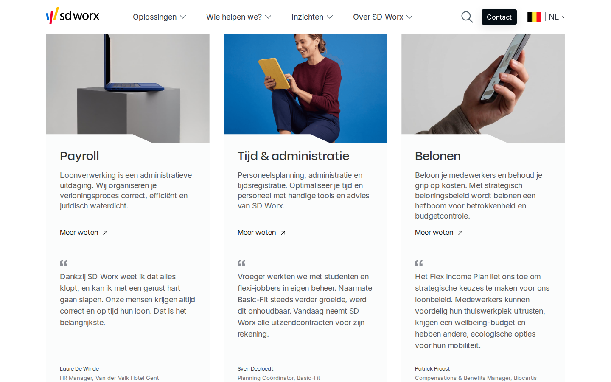
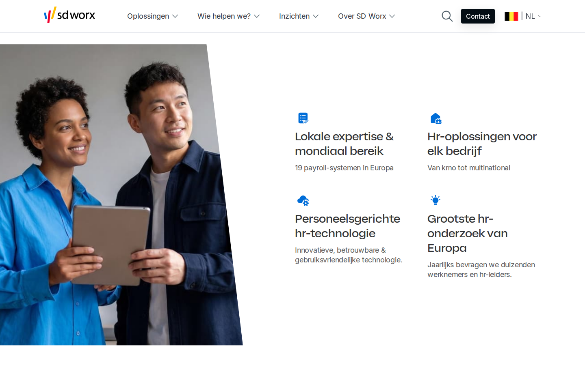

# SD Worx — Brand & Style Guide (voor projecten in hun stijl)

Dit document bundelt alles wat nodig is om iets te bouwen dat aanvoelt als SD Worx.
Het is **afgeleid van de publieke website** [sdworx.be/nl-be](https://www.sdworx.be/nl-be) en van het
design system dat SD Worx zelf publiek host (**"Ignite"**, `cdn.sdworx.com/ignite`). Kleurcodes,
lettergroottes, radius en spacing zijn rechtstreeks uit hun CSS gehaald, niet geschat.

> ⚠️ Dit is geen officiële brand book (SD Worx publiceert de volledige guidelines niet openbaar). Het bevat wel de nieuwe huisstijl van juni 2026 zoals beschreven en getoond in hun persbericht (§1b). Voor externe publicatie, drukwerk of logogebruik door derden:
> vraag de officiële guidelines/assets aan bij SD Worx. Logo's en fonts zijn hun eigendom.

| Bestand | Inhoud |
|---|---|
| [`tokens/tokens.css`](tokens/tokens.css) | Alle tokens als CSS-variabelen (`--sdw-*`), incl. licht/donker |
| [`tokens/tokens.json`](tokens/tokens.json) | Dezelfde tokens als JSON |
| [`brand/logo/`](brand/logo) | Logo (kleur) en logo (wit) als SVG |
| [`examples/index.html`](examples/index.html) | Voorbeeldpagina in SD Worx-stijl (hero, kaarten, USP's, knoppen) |
| [`docs/`](docs) | Screenshots van de homepage als referentie |

---

## 1. Merk in een notendop

- **Wie**: SD Worx — Europese HR-, payroll- en tijdsregistratiepartner (Belgische oorsprong, 100.000+ klanten, wereldwijd netwerk).
- **Claim / tagline**: **"Trusted to make work work"** (nieuwe merkidentiteit, gelanceerd juni 2026).
- **Homepage-kop**: "HR, Pay & Time" met subtitel "Voor ieder team, in elke organisatie".
- **Kernbelofte**: *"Maak als organisatie gebruik van intelligente technologie, stevige expertise en betrouwbare dienstverlening en verander complexiteit in vertrouwen."*
- **Merkwoorden**: betrouwbaar · menselijk · slim/intelligent · eenvoudig · Europees/lokaal + mondiaal.
- **Kernbewijzen (proof points)**: 100.000+ bedrijven · 19 payroll-systemen in Europa · van kmo tot multinational · grootste hr-onderzoek van Europa · tellers voor jaren ervaring, eigen hr-experts en landen in het netwerk (waarden laden dynamisch op de site).

### Productdomeinen (info-architectuur)
Payroll · Tijd & administratie · Belonen · HR-expertise · SAP-oplossingen. Doelgroepen: kmo, grote organisaties,
internationale organisaties, boekhouders & accountants, zelfstandigen. Sub-merken: **.academy**, **mysdworx** (app), **SD Worx Compass**, **SD Worx Jobs**.

## 1b. Nieuwe huisstijl — juni 2026 (bron: persbericht)

Bron: [A new look for SD Worx](https://www.sdworx.com/en-en/about-sd-worx/press/2026-06-25-new-look-sd-worx-introducing-brand-makes-work-work) (25 juni 2026). Het persbericht beschrijft: *nieuwe kleuren, een flexibeler logosysteem, een duidelijkere visuele taal, vernieuwde typografie en een consistente digitale ervaring; een systeem dat schaalt over producten, content en markten.*



**Merkidee en positionering**
- Kernidee: **"SD Worx makes work work."** — werkgevers, werknemers en regelgeving op één lijn brengen via intelligente HR-, Pay- en Time-oplossingen, zodat organisaties met vertrouwen vooruit kunnen.
- Rol: **"Europe's backbone of work"** en *"the work behind work"* — het onzichtbare maar essentiële dat werk draaiend houdt.
- Ambitie: **Europe's leading HR, Pay and Time partner.**
- Vier pijlers: **intelligent technology · deep expertise · reliable delivery · local knowledge.**
- Ontwerpkarakter (citaat Justine Kerr, Creative Agency Lead): het design system is **"fluid, connected, and modern. Built to move with the world"**.
- Kerncijfers (2025/2026): **100.000+ organisaties · 6 miljoen werknemers betaald per maand · omzet EUR 1,3 miljard (2025).**

**Wat je in het visuele materiaal ziet**
1. **Logo op effen blauwe tegel** (`≈ #0076DA` in het persbeeld) met wit logo; kleurlogo op wit. Het logo is dus flexibel: blauw vlak, wit, of kleur.
2. **Palet als gestapelde strook**: lichtblauw → hemelblauw → **diep marine** → **rood** → **geel** → wit.
   Gemeten (JPEG, ± kleurprofiel): `#B0DCFF` · `#5EAFFF` · `#00235D` · `#F1002F` · `#FFBE00`. Rood en geel zijn hier duidelijk **kleine accenten**, marine/blauw domineren.
3. **Gestapelde gradiënt-kaarten**: blauw → geel → bijna-zwart marine, met zachte, glanzende verlopen (glossy/frosted). Achtergrond: zacht **lichtblauw** (`≈ #A3D4FF`).
4. **Zachte mesh-gradiënt achtergronden**: wit ↔ lichtblauw (`#E7F3FF` → `#ADD7FD`) met quote in **zwart + één woord in merkblauw** ("Built for how **Europe** works.").
5. **Sticker-chips**: schuin gedraaide pill-labels (radius ≈ 16 px) in **blauw / rood / geel** die over grote zwarte koppen heen "plakken" ("More connected" + *Data*, *Network*, *Clarity*). Tekst in chips: SD Worx Display, wit op blauw/rood, **zwart op geel**.
6. **Gewichtsspel als merkelement**: dezelfde woorden van **Light → Bold** in een blauwverloop (`#B6DCFF` → `#5EAFFF` → `#278BEB` → `#004C9A` → `#000`) — "bolder". Koppen mengen gewichten: *"Connecting **HR, Pay** and **Time** across Europe"* (kernwoorden bold).
7. **Fotografie**: portretten met **blauwgrijs fond** (`≈ #6F95AA`), donkermarine kleding, **gele tablet/map** als kleuraccent; foto vaak **uitgesneden in een veelhoek/schuine vorm** binnen een wit kader op een blauw vlak (`≈ #0055A0`), of geknipte studio-portretten.
8. **UI-motieven**: zwarte pill-tooltip met cursor ("Payroll Admin"), **cirkelpijl-icoon** (omcirkeld →/←), dun omlijnde kaart met blauwe rand (1 px, radius ≈ 8–12 px).
9. **Datavisualisatie**: gerande, **afgeronde staven** in lichtblauw (`#66B4FF`) met de **actieve staaf in merkblauw**, een gladde lijn in blauw en een datapunt-label; assen in Inter, klein en grijs.





> Kleurwaarden uit afbeeldingen zijn **gemeten op JPEG's met kleurprofiel** en dus ± enkele eenheden. De live-website-tokens in §3 (`#006DD8`, `#F1002F`, `#FFBE00`) blijven leidend voor code; in beeldmateriaal mag het blauw iets helderder ogen.

---

## 2. Logo


- **Woordmerk** "sd worx" in **kleine letters**, geometrisch/gesloten sans-serif, voorafgegaan door een **symbool van drie schuine strepen** (blauw · rood · geel).
- Logokleuren: **Blauw `#006DD8`**, **Rood `#F1002F`**, **Geel `#FFBE00`**; woordmerk in **zwart/donkergrijs**.
- Varianten in deze repo: `sdworx-logo.svg` (kleur, op wit/licht) en `sdworx-logo-white.svg` (wit, op donker of foto's).
- Formaat origineel: 128 × 41 (verhouding ≈ 3,1 : 1). Op de site staat het 127 px breed in een 80 px hoge header.
- **Uit het persbericht**: het logo is nu een *flexibel systeem* — kleurenversie op wit, wit logo op een effen blauwe tegel (zie §1b).
- **Regels (aanbevolen, eigen inschatting)**: vrije ruimte rondom ≥ hoogte van de "s"; niet vervormen, niet herkleuren, niet op drukke achtergronden zonder wit logo; minimaal ≈ 96 px breed op scherm.
- De **schuine strepen** zijn het grafische DNA: ze komen terug in de diagonale sneden van beelden en secties (zie §7).

---

## 3. Kleuren

### 3.1 Merkkleuren (logo)
| Naam | Hex | Gebruik |
|---|---|---|
| **SD Worx Blauw** | `#006DD8` | Primaire actiekleur: knoppen, links, iconen, focus |
| **SD Worx Rood** | `#F1002F` | Alleen logo / spaarzaam accent |
| **SD Worx Geel** | `#FFBE00` | Alleen logo / spaarzaam accent (komt terug in fotografie: gele telefoon/tablet) |

### 3.2 Primary blauwschaal
| Token | Hex | Rol |
|---|---|---|
| `primary-950` | `#000D3A` | Diepste marine, koppen op licht-blauw, strong text |
| `primary-900` | `#001C52` | Donker blok, hover-emphasis |
| `primary-700` | `#005BBF` | Pressed, primaire tekst/links op wit |
| **`primary-600`** | **`#006DD8`** | **Standaard actie (knop, link, icoon)** |
| `primary-500` | `#0087F3` | Hover |
| `primary-300` | `#9ED2FF` | Actie in dark mode, borders |
| `primary-100` | `#D9F1FF` | Zachte achtergrond, selected |
| `primary-50` | `#EFFAFF` | Subtiele achtergrond |

### 3.3 Neutralen (koel grijs)
`#050607` · `#131415` · `#212223` · `#323334` · `#444547` · `#5A5B5C` · `#737476` · `#88898B` · `#D9DBDD` · `#EAEBED` · `#F4F5F6` · `#FBFCFC` · `#FFFFFF`

Website-specifiek: **body-tekst `#303642`**, **donkere CTA "Contact" `#040D14`**, kaartachtergrond `#FBFCFC`, paginabg wit.

### 3.4 Semantisch
| Rol | Licht | Donker |
|---|---|---|
| Info | `#006AFF` | `#8FBEFF` |
| Succes | `#007900` | `#75D87A` |
| Waarschuwing | `#F3B01D` | `#F3B01D` |
| Fout | `#E90040` | `#FF979D` |

### 3.5 Accentpalet (14 tinten, voor tags/categorieën/illustraties)
Elk accent heeft een *bold*, *subtle* achtergrond en donkere tekstkleur — zie `tokens.css` (`--sdw-accent-0 … 13`):
oranjerood `#DA3300` · oranje `#FFA659` · olijf `#8E7A00` · lime `#B2CB5C` · groen `#009559` · mint `#23DBC1` · teal `#008E96` · cyaan `#25D2FC` · blauw `#0083CE` · lavendel `#AEB4FF` · paars `#9051E1` · orchidee `#E59FF6` · magenta `#CB2F90` · roze `#FF95BA`.

### 3.6 Data-visualisatie (categorisch, in volgorde gebruiken)
`#006DD8` `#75001C` `#00A38C` `#003F6C` `#AC77FA` `#710037` `#F05B93` `#533300` `#E67600` `#5E2B9A`

### 3.7 Gebruiksverhouding (indicatief, eigen inschatting op basis van de homepage)
Ruim **wit/licht (±80 %)**, **neutraal donker voor tekst (±12 %)**, **SD Worx-blauw als enige echte actiekleur (±6 %)**, rood/geel/accenten **≤ 2 %**. De merkbeleving komt vooral van **fotografie met een verzadigd blauw fond** (hero) in plaats van vlakken kleur in de UI.

### 3.8 Toegankelijkheid
- Tekst op wit: `#303642` (body), `#323334`/`#050607` (koppen) → ruim AAA.
- `#006DD8` op wit ≈ AA voor grote tekst/UI; voor lopende linktekst liever `#005BBF`.
- Witte tekst op `#006DD8` ok (knoppen). Gebruik `--ig-opacity-disabled: .4` voor uitgeschakelde elementen.

---

## 4. Typografie

| Rol | Lettertype | Bron |
|---|---|---|
| **Koppen / display** | **SD Worx Display** (variabel, gewichten 100–900; ook Light 300 / Regular 400 / Medium 500 / Bold 700 + italics) | eigen font, gehost op `cdn.sdworx.com/ignite/assets/v2/fonts/all.css` |
| **Body / UI / captions** | **Inter** (variabel 100–900) | idem (of Google Fonts) |
| Mono | `consolas` | fallback |

Nieuwe typografie (2026): koppen gebruiken een **groot gewichtsbereik (Light → Bold)** en mengen gewichten binnen één kop; body blijft Inter. Karakter van de koppen: geometrisch, open en vriendelijk (enkelvoudige "a" en "y" met rechte staart), **sentence case**, veel wit, medium gewicht.

### Schaal (rem; 1rem = 16 px) — font-size / line-height
| Stijl | Grootte | Line-height | Opmerking |
|---|---|---|---|
| Expressive Display 1 | 7.5rem (120px) | 6.75rem | Hero-kop "HR, Pay & Time", wit, gewicht 500 |
| Expressive Display 2 | 4.5rem (72px) | 4rem | |
| Heading XXL | 3rem | 3.25rem | |
| Heading XL | 2.5rem | 2.75rem | |
| Heading L | 2rem | 2.25rem | Kaartkoppen/sectiekoppen (site h3: 32/36, gewicht 500) |
| Heading M | 1.75rem | 1.875rem | |
| Heading S | 1.5rem | 1.75rem | |
| Heading XS | 1.25rem | 1.5rem | |
| Heading XXS | 1.125rem | 1.375rem | |
| Body L | 1.25rem | 1.75rem | |
| **Body** | **1.125rem (18px)** | **1.5rem** | Standaard tekst op de site |
| Body S | 1rem | 1.375rem | Navigatie, links |
| Body XS | .875rem | 1.125rem | |
| Caption | .75rem | 1rem | Bronvermelding, functie klant |

Gewichten: Light 300 · Regular 400 · **Medium 500 (knoppen, koppen)** · Semi-bold 600 · Bold 700.
Overline/label boven een kop ("Oplossingen") = Body, regular, grijs, kleine letters, gevolgd door grote kop.

---

## 5. Layout & grid

- **Container**: max-breedte **1224 px**, gecentreerd (op 1440 px → marges van 108 px).
- **Breakpoints (min-width)**: `576` · `768` · `992` · `1200` · `1440` · `1912` px.
- **Header**: topbalk 48 px (`#F6F6F6`, tabs "HR & Payroll" / ".academy", rechts Support + Aanmelden) + hoofdnavigatie 80 px wit, 1 px onderrand. Nav: Oplossingen · Wie helpen we? · Inzichten · Over SD Worx, zoek-icoon, zwarte **Contact**-knop, taalkeuze met vlag.
- **Spacing-schaal**: 4 · 6 · 8 · 12 · 16 · 20 · 24 · 32 · 40 · 48 · 64 · 80 · 96 · 128 · 160 px. Sectiemarges op de site zijn ruim (indicatief 96–128 px).
- **Secties**: hero (fullbleed foto + wit display-kop) → klantlogo's ("Meer dan 100.000 bedrijven vertrouwen op SD Worx") → oplossingskaarten (3 + 2 kolommen) → statistieken/claim "Trusted to make work work" met tellers → USP-raster (2×2, icoon + kop + omschrijving) naast schuin gesneden foto → doelgroep-kaarten → certificaten/awards → CTA → footer.

---

## 6. Componenten

**Knoppen** (Inter, gewicht 500, radius **4 px**):
| Variant | Achtergrond | Tekst | Rand | Padding |
|---|---|---|---|---|
| Primair (blauw) | `#006DD8` → hover `#0087F3` → pressed `#005BBF` | wit | 1px zelfde | 6–7 × 16–48 px |
| Zwart (header-CTA) | `#040D14` | wit | – | 6 × 12 px, 16px |
| Wit (op foto's) | `#FFFFFF` | `#323334` | 1px wit | 7 × 16 px, 20px |
| Tekstlink | transparant | `#323334`, onderlijn 1px + pijl ↗ | – | "Meer weten ↗" |

**Kaarten**: achtergrond `#FBFCFC`, 1 px lichtgrijze rand, radius 4 px, **beeld bovenaan met diagonaal "notch"-snede onderaan**, kop (Display, 32px/medium), tekst (body, `#5A5B5C`), link "Meer weten ↗", scheidingslijn, daarna **klantquote** (aanhalingsteken-icoon, quote, naam klein, functie + bedrijf in grijs).

**Inputs**: radius 4 px, focus-radius 4 px; zoekveld met blauwe knop `#006DD8` rechts.

**Iconen**: eigen icon-font **`ignite-icons`** (honderden `ig-icon-f-*`), gevulde stijl in blauw `#006DD8`; te vinden via `cdn.sdworx.com/ignite/visuals/v2/2.3.0/all.css`.

**Schaduwen (elevation)** — blauwgetinte schaduw `rgba(4,41,65,…)`:
`level-1` `0 0 3px #04294114, 0 2px 6px -1px #04294133` · `level-2` `0 1px 8px #0429411c, 0 5px 8px #0429411a` · `level-3` `0 1px 8px #0429411f, 0 6px 12px #0429412b` · `level-4` `0 8px 24px #04294133, 0 3px 8px #0429411f`.

**Radius**: 0 · 2 · **4 (standaard)** · 8 px. Weinig afronding: scherp, zakelijk, vriendelijk.
**Motion**: 0.25 s (standaard), 0.1 s (snel); subtiele hover-kleurwissels, geen bounce.

---

## 7. Beeldtaal



- **Portretfotografie van echte, diverse mensen** (medewerkers, hr-managers) — natuurlijk, warm, close-up, vaak **effen verzadigd blauw of neutraal grijs fond**.
- **Kleurpop via kleine gele/kobalt objecten** (gele tablet/telefoonhoes, kobaltblauw laptop) — echo van het logo (geel + blauw).
- Donkermarine kledij (`≈ #001C52`), authentiek gebaar (lachend, kijkend, telefoon vasthoudend). Geen stockachtige gladde pose.
- **Diagonale sneden** (clip-path) op foto's en secties als terugkerend motief, geïnspireerd op de logostrepen, bv.
  `polygon(0 0, 90% 0, 100% 100%, 0 100%)`, of een kleine **notch onderaan kaartbeelden**: `polygon(0 0,100% 0,100% 100%,71% 100%,59% 93%,0 93%)`.
- Klantlogo's in **grijswaarden/monochroom** in een rij.
- Veel witruimte; geen zware gradients, geen illustratiestijl op de homepage (wel iconen).




---

## 8. Tone of voice

- **Taal**: Nederlands (be), Frans, Engels — **je-vorm** ("Maak als organisatie gebruik van…", "Ontdek alles"), nooit u.
- **Karakter**: deskundig maar toegankelijk; kalm zelfvertrouwen; concreet i.p.v. jargon; *complexiteit → vertrouwen*.
- **Structuur**: korte kop (2–5 woorden) + 1–2 zinnen uitleg + duidelijke CTA.
- **Koppen**: sentence case, geen uitroeptekens. Voorbeelden: *"Een partner voor HR, Pay & Time"*, *"Ga vooruit met vertrouwen"*, *"Trusted to make work work"*.
- **CTA's**: "Ontdek alles", "Meer weten", "Contacteer ons", "Lees het klantverhaal", "Schrijf je in".
- **Bewijs boven belofte**: cijfers (100.000 bedrijven, 19 systemen) en klantquotes met naam, functie en bedrijf.
- **Schrijfwijze**: "hr" en "kmo" in kleine letters; Engelse merkzinnen (*Trusted to make work work*, *HR, Pay & Time*) blijven Engels.
- **Woordkeuze 2026**: *connected, backbone, confidence/vertrouwen, clarity, Europe*; korte, stellige slogans: *"Built for how Europe works."*, *"More connected."*, *"Connecting HR, Pay and Time across Europe"*.
- **Vermijd**: overdreven marketingtaal, hype, humor over personeel/loon, "u".

---

## 9. Snel starten

```html
<link rel="stylesheet" href="tokens/tokens.css">
<style>
  body { font: 400 var(--sdw-body)/var(--sdw-body-lh) var(--sdw-font-body); color: var(--sdw-site-text); background: var(--sdw-bg-page); }
  h1, h2, h3 { font-family: var(--sdw-font-heading); font-weight: 500; }
  .btn { background: var(--sdw-action); color: #fff; border-radius: var(--sdw-radius); padding: 7px 16px; font-weight: 500; transition: background var(--sdw-duration); }
  .btn:hover { background: var(--sdw-action-hover); }
</style>
```

Zie [`examples/index.html`](examples/index.html) voor een volledige pagina.

### Checklist voor een project "in SD Worx-stijl"
- [ ] Wit fundament, tekst `#303642`, één actiekleur `#006DD8`
- [ ] SD Worx Display voor koppen (medium), Inter voor de rest (18 px body)
- [ ] Radius 4 px, dunne 1 px randen, lichte blauwgetinte schaduwen
- [ ] Portretfoto's met blauw/grijs fond + diagonale sneden
- [ ] Logo in kleur op licht, wit op donker/foto; vaste header van 80 px
- [ ] Je-vorm, concreet, met cijfers en klantquotes
- [ ] Sticker-chips (blauw/rood/geel), gewichtsspel in koppen en zachte lichtblauwe gradiënt-achtergronden voor de 2026-look
- [ ] Licht én donker thema via `light-dark()` tokens

## 10. Bronnen & herkomst
- Homepage [sdworx.be/nl-be](https://www.sdworx.be/nl-be) (HTML, CSS, screenshots, computed styles)
- Ignite design system: `cdn.sdworx.com/ignite/styling/v2/2.2.0/website/system.css`, `…/assets/v2/fonts/all.css`, `…/visuals/v2/2.3.0/all.css`
- Persbericht [A new look for SD Worx (25 juni 2026)](https://www.sdworx.com/en-en/about-sd-worx/press/2026-06-25-new-look-sd-worx-introducing-brand-makes-work-work), aangeleverd als PDF — bron voor §1b (merkidee, pijlers, cijfers en de beelden in `docs/press-2026-*.jpg`, © SD Worx). Kleur- en typografiewaarden voor code komen uit de live CSS.

*Vastgelegd op 30 september 2026. Merkidentiteiten evolueren: controleer de live site bij twijfel.*
